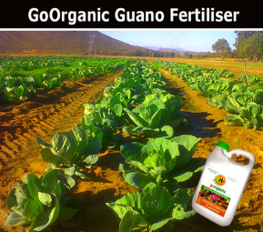

The word 'Guano' originates from the Quiche language and translates to 'the droppings of sea birds'. Andean inhabitants collected Seabird Guano from the coast of Peru for use as soil fertilizer. Natural Seabird Guano has been used by farmers and growers since before recorded history. Civilizations have used Seabird Guano as a soil amendment.
The word 'Guano' originates from the Quiche language of the Andes and means 'the droppings of sea birds'. Andean inhabitants collected Seabird Guano from the coast of Peru for use as soil fertilizer. Natural Seabird Guano has been used by farmers and growers since before recorded history. Many civilizations have used Seabird Guano as a soil amendment and considered it sacred.
Seabird Guano organic fertilizer is now available throughout South Africa from Go Organic Guano.  The seabird guano used in Go Organic Guano's products is sourced sustainably using environmentally friendly methods from Namibian Islands.  Go Organic Guano is produced locally in South Africa and contains 100 % natural ingredients.

You will be ecstatic with the results you get when you use Seabird Guano organic fertilizer in your farm, garden or lawn application. Mix it into your potting soil when potting new plants or re-potting old plants. Top-dress potted plants; apply it to your lawn, flower and vegetable gardens. You'll be amazed at the results. You can use Go Organic Guano organic fertilizer for any application you would ordinarily use regular fertilizer for.

At Go Organic Guano, we would rather let visual results of our incredible fertilizer product speaks for itself.  Our promise to you, our valued customer, is that Go Organic Guano 'delivers the results'!  It does exactly what it says on the container.  Members of the Go Organic Guano Fertilizer Research and Development division allocated two plots of farm land, side by side, planting cabbage seeds at exactly the same time.  Only ONE plot of land was treated with Go Organic Guano.  CAN you spot which one?

We are registered with the Department of Agriculture, Forestry & Fisheries

Contact Info:

Telephone number: +27 (79) 630 5841
 
Email: [sales@goorganicguano.co.za](mailto:sales@goorganicguano.co.za)
